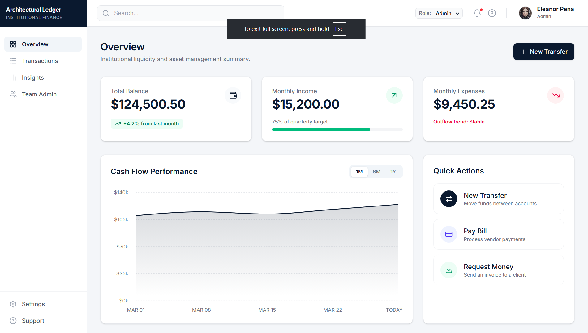
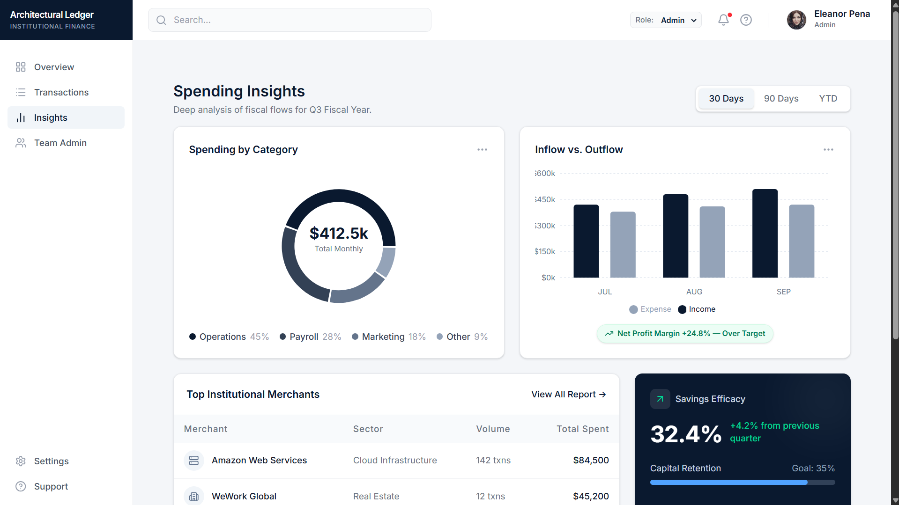

# Architectural Ledger

> **Institutional Finance Dashboard** — A clean, role-aware finance management interface built for tracking liquidity, capital flows, and spending intelligence.

---

## 🔗 Live Demo

**[View Live Deployment →](https://financedashboardd-r9ihpkurc-anushkagupta3005s-projects.vercel.app/)**

> Switch between roles using the role selector in the top header to see how the UI adapts in real time.

---

## 🖼️ Screenshots

### Overview Dashboard


### Transaction History


### Spending Insights


### Team Administration


---

## 🚀 Features

### Core
- **Responsive Layout** — Adapts gracefully from desktop to mobile with a collapsible off-canvas sidebar
- **Dark Mode** — Persisted dark mode support with tailored aesthetic adjustments
- **Role-Based Access Control** — Admins, Analysts, and Viewers see different feature sets and action states
- **Data Persistence** — Transactions and current user role state are saved locally across sessions
- **Micro-Interactions** — Loading skeleton, press-animations on buttons, and smooth hover lifts on cards

### 📋 Pages
| Page | Description |
|------|-------------|
| **Overview** | High-level financial summary — Total Balance, Monthly Income/Expenses, Cash Flow chart |
| **Transactions** | Filterable & sortable transaction records with category badges, export options |
| **Insights** | Donut charts, bar charts, merchant tables, savings efficacy, budget utilization |
| **Team Admin** | Role hierarchy, authorized personnel, seat usage — Admin only |

---

## 🛠️ Tech Stack

| Layer | Choice | Reason |
|-------|--------|--------|
| **Framework** | React 18 | Component model, hooks, Context API |
| **Styling** | Tailwind CSS v4 | Utility-first, premium layout styling |
| **Charts** | Recharts | React-native API for interactive visualizations |
| **Icons** | Lucide React | Consistent, clean SVG icon system |
| **Tooling** | Vite | Fast dev server, optimized builds |
| **State** | Context API | Global state without Redux overhead |
| **Persistence** | localStorage | Session continuity across page refreshes |

---

## 💻 Getting Started

### Prerequisites
- Node.js 18+
- npm or yarn

### Installation

```bash
# 1. Clone the repository
git clone https://github.com/Anushkagupta3005/FinanceDashboard.git

# 2. Navigate into the project
cd FinanceDashboard

# 3. Install dependencies
npm install

# 4. Start the development server
npm run dev
```

The app will be available at `http://localhost:5173`

---

## 🔐 Role-Based Access

Switch roles using the **dropdown in the top header bar** to preview each experience.

| Feature | Viewer | Analyst | Admin |
|---------|:------:|:-------:|:-----:|
| View Overview | ✅ | ✅ | ✅ |
| View Transactions | ✅ | ✅ | ✅ |
| Filter & Search | ✅ | ✅ | ✅ |
| View Insights | ✅ | ✅ | ✅ |
| New Transfer button | ❌ | ✅ | ✅ |
| Export CSV / PDF | ❌ | ❌ | ✅ |
| Team Admin page | ❌ | ❌ | ✅ |
| Edit Member Roles | ❌ | ❌ | ✅ |

> **Note:** RBAC is UI-only, intended for frontend demonstration purposes only.

---

## 👤 Author

**Anushka Gupta**
- GitHub: [@Anushkagupta3005](https://github.com/Anushkagupta3005)

---

<p align="center">Built with ❤️ using React · Tailwind CSS · Recharts</p>
