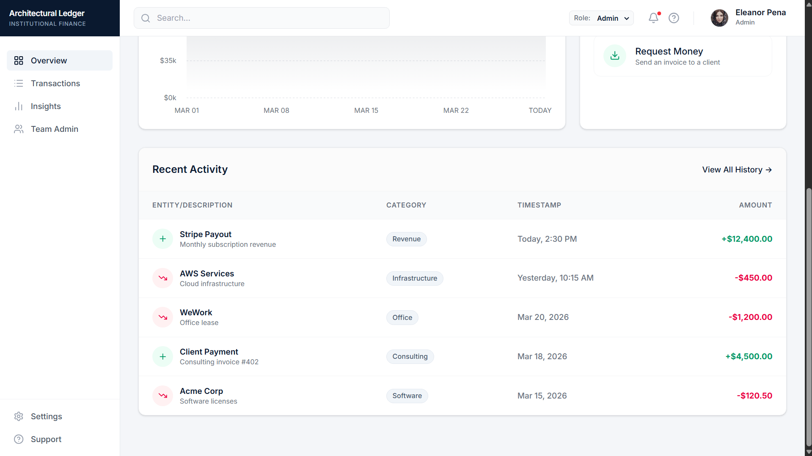
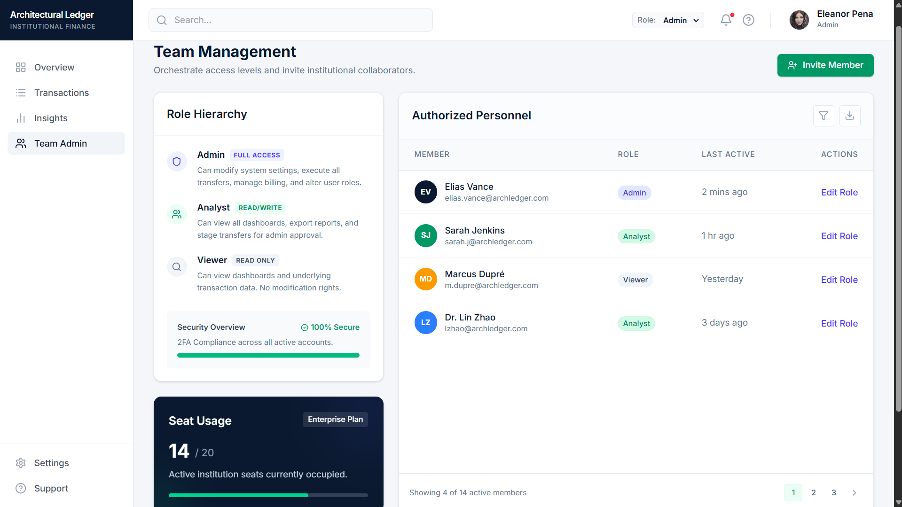

# Architectural Ledger

> **Institutional Finance Dashboard** — A clean, role-aware finance management interface built for tracking liquidity, capital flows, and spending intelligence.


---

## 🔗 Live Demo
**[View Live Deployment →](https://tinyurl.com/mrx6pk9f)**

> Switch between roles using the role selector in the top header to see how the UI adapts in real time.

---

## 🖼️ Application Showcases

### 1. Overview Dashboard

*High-level financial summary, cash flow charts, and quick actions.*

### 2. Transaction History

*Filterable and sortable transaction records with detailed meta-information.*

### 3. Spending Insights

*Deep analytics for spending, budget utilization, and institutional merchant volume.*

### 4. Team Administration

*Access management for Admin-only interactions, role hierarchy, and authorized personnel.*

---

## 🚀 Features

### Core
- **Responsive Layout**: Adapts gracefully from desktop to mobile with a collapsible off-canvas sidebar.
- **Dark Mode**: Persisted dark mode support with tailored aesthetic adjustments.
- **Role-Based Access Control**: Admins, Analysts, and Viewers see different feature sets and action states.
- **Data Persistence**: Transactions and current user role state are saved locally across sessions.
- **Micro-Interactions**: Features a loading skeleton, press-animations on buttons, and smooth hover lifts on cards.

### Pages
- **Overview**: High-level financial summary and cash flow charts.
- **Transactions**: Filterable and sortable transaction records out of a mocked local database.
- **Insights**: Analytics for spending and budget utilization.
- **Team Admin**: Access Management for Admin-only interactions.

---

## 🛠️ Tech Stack

| Layer | Choice | Reason |
|---|---|---|
| **Framework** | React 18 | Component model, hooks, Context API |
| **Styling** | Tailwind CSS v4 | Utility-first, premium layout styling |
| **Charts** | Recharts | React-native API for interactive data visualizations |
| **Icons** | Lucide React | Consistent, premium SVG icons |
| **Tooling** | Vite | Fast dev server, optimized builds |

---

## 💻 Getting Started

### Prerequisites
- Node.js 18+
- npm or yarn

### Installation
```bash
# 1. Clone the repository
git clone https://github.com/Anushkagupta3005/FinanceDashboard.git

# 2. Navigate into the project
cd FinanceDashboard

# 3. Install dependencies
npm install

# 4. Start the development server
npm run dev
```

The app will be available at `http://localhost:5173`

---

## 🔐 Role-Based Access

Roles are simulated entirely on the frontend. Switch roles using the **dropdown in the top header bar**.

| Feature | Viewer | Analyst | Admin |
|---|:---:|:---:|:---:|
| View Overview | ✅ | ✅ | ✅ |
| View Transactions | ✅ | ✅ | ✅ |
| Filter & Search | ✅ | ✅ | ✅ |
| View Insights | ✅ | ✅ | ✅ |
| New Transfer button | ❌ | ✅ | ✅ |
| Export CSV / PDF | ❌ | ❌ | ✅ |
| Team Admin page | ❌ | ❌ | ✅ |
| Edit Member Roles | ❌ | ❌ | ✅ |

> **Security Note:** This RBAC is UI-only and not secure. It is intended solely for frontend demonstration purposes.

---

## 👤 Author

**Anushka Gupta**
- GitHub: [@Anushkagupta3005](https://github.com/Anushkagupta3005)

---
<p align="center">Built with React · Tailwind CSS · Recharts</p>
