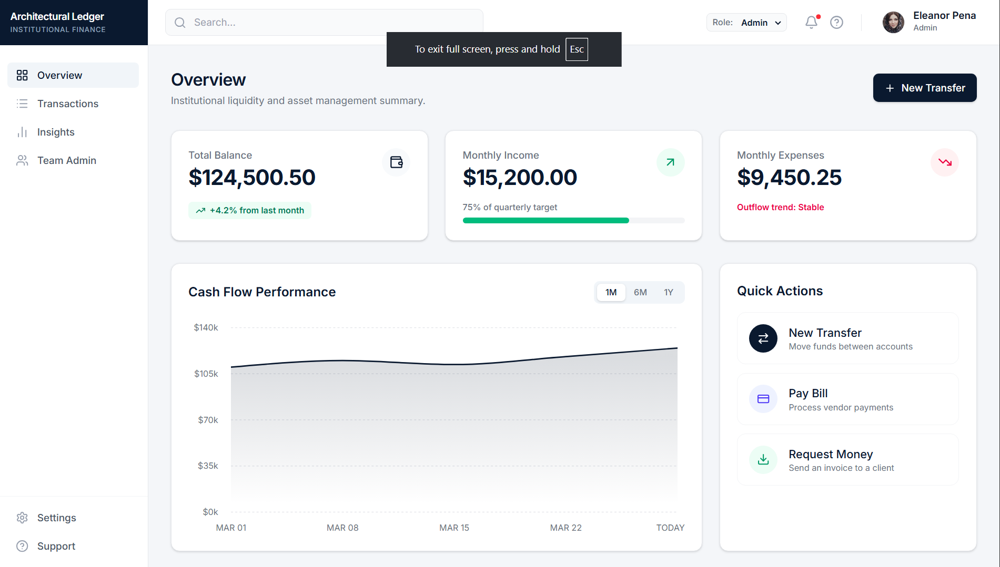
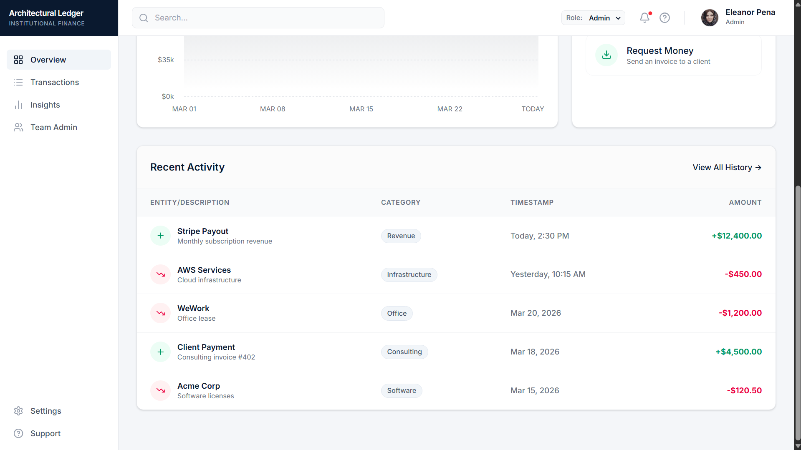
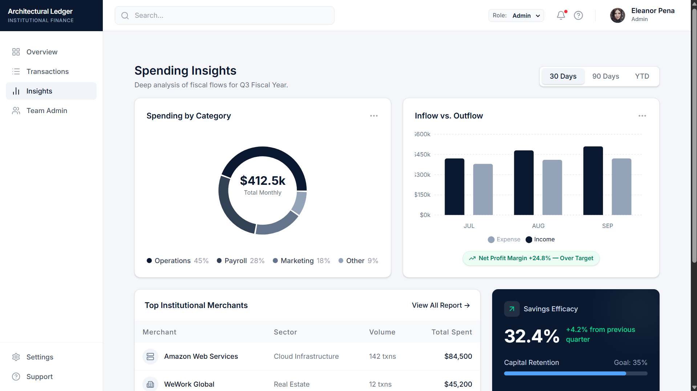
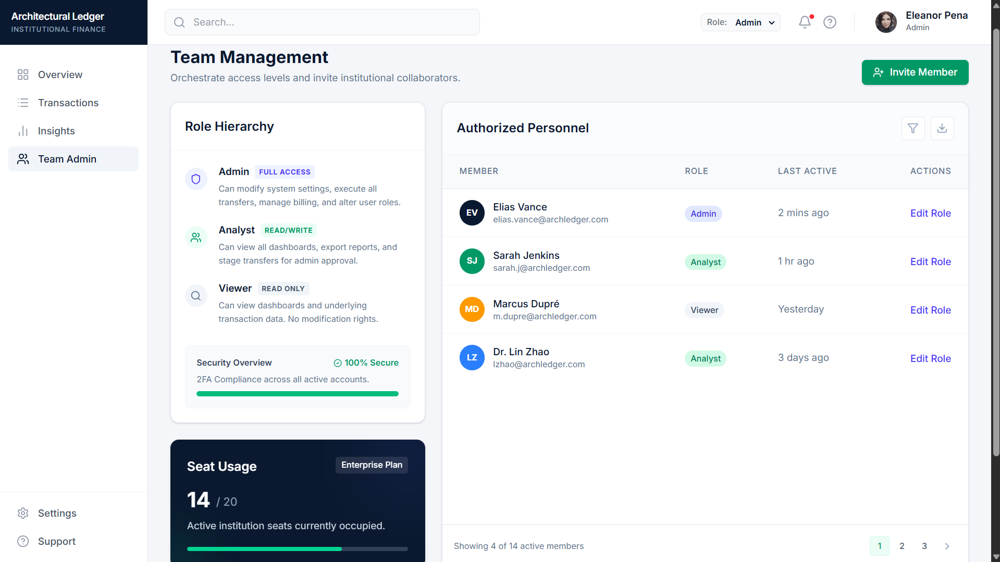

# Architectural Ledger

A full-stack finance dashboard for tracking liquidity, capital flows, and spending
intelligence — with real authentication, server-enforced role-based access control, and
insights computed live from a Postgres-backed transactions API.

---

## Screenshots

| Overview | Transactions |
| --- | --- |
|  |  |

| Insights | Team Admin |
| --- | --- |
|  |  |

---

## Features

- **Authentication & RBAC** — JWT-based login with bcrypt-hashed passwords. Three roles
  (Admin, Analyst, Viewer), enforced server-side — a Viewer hitting a write endpoint gets
  a real `403`, not just a hidden button.
- **Transactions API** — full CRUD with server-side filtering, search, sorting, and
  pagination.
- **Live insights** — balance, cash flow, category breakdowns, and top counterparties,
  all computed from the database and updated instantly when a transaction is added.
- **CSV export** and an **audit log** of sensitive actions (Admin only).
- **Responsive UI** — dark mode, collapsible sidebar, loading skeletons, and smooth
  micro-interactions.

---

## Tech stack

| Layer | Choice |
| --- | --- |
| Frontend | React 18, Tailwind CSS v4, Recharts, Vite |
| Backend | Node.js, Express |
| Database | PostgreSQL (via Prisma ORM) |
| Auth | JWT + bcrypt |
| Validation | Zod |

---

## Getting started

You'll need Node.js 18+ and a Postgres database (local via Docker, or a free hosted one
like Neon, Railway, or Supabase).

### Backend

```bash
cd backend
npm install

cp .env.example .env
# set DATABASE_URL to your Postgres instance, and a real JWT_SECRET

npm run prisma:migrate      # creates the schema
npm run seed                # seeds demo users + sample transactions

npm run dev                 # http://localhost:4000
```

No Postgres handy? Spin one up with Docker:

```bash
docker run --name ledger-db -e POSTGRES_PASSWORD=postgres \
  -e POSTGRES_DB=finance_dashboard -p 5432:5432 -d postgres:16
```

### Frontend

```bash
cd ..            # repo root
npm install

cp .env.example .env
# set VITE_API_URL=http://localhost:4000/api

npm run dev                 # http://localhost:5173
```

### Log in

| Role    | Email              | Password    | Can do                                                 |
| ------- | ------------------ | ----------- | ------------------------------------------------------- |
| Admin   | admin@ledger.dev   | admin1234   | Everything — create/edit/delete, export, manage roles   |
| Analyst | analyst@ledger.dev | analyst1234 | View + create/edit transactions                         |
| Viewer  | viewer@ledger.dev  | viewer1234  | View only                                                |

---

## API reference

Base URL: `http://localhost:4000/api`
Send the token from login/register as `Authorization: Bearer <token>`.

### Auth

| Method | Path | Access | Description |
| ------ | ---- | ------ | ----------- |
| POST | `/auth/register` | Public | Register (defaults to Viewer) |
| POST | `/auth/login` | Public | Log in, returns `{ token, user }` |
| GET | `/auth/me` | Auth | Current user |

### Transactions

| Method | Path | Access | Description |
| ------ | ---- | ------ | ----------- |
| GET | `/transactions` | Any role | List — filters + pagination (below) |
| GET | `/transactions/:id` | Any role | Single transaction |
| POST | `/transactions` | Analyst, Admin | Create |
| PUT | `/transactions/:id` | Analyst, Admin | Update |
| DELETE | `/transactions/:id` | Admin | Delete |
| GET | `/transactions/export/csv` | Admin | Download filtered CSV |

**List query params:** `type` (income\|expense), `status` (completed\|pending),
`category`, `search`, `page`, `pageSize`, `sort` (date\|amount), `order` (asc\|desc).
Example: `/transactions?type=expense&search=blackstone&page=1&pageSize=7`

### Insights (any role)

| Method | Path | Description |
| ------ | ---- | ----------- |
| GET | `/insights/summary` | Balance, income, expense, cash flow |
| GET | `/insights/by-category` | Totals grouped by category |
| GET | `/insights/top-entities` | Largest counterparties |

### Team Admin (Admin only)

| Method | Path | Description |
| ------ | ---- | ----------- |
| GET | `/users` | List all users |
| PATCH | `/users/:id/role` | Change a user's role |
| GET | `/audit-log` | Recent activity feed |

---

## Architecture

Permissions are enforced in `backend/src/routes/index.js` via `requireRole(...)`
middleware (`backend/src/middleware/auth.js`), not in the UI — so access control holds
even if someone bypasses the frontend entirely. Every sensitive action is recorded in the
`AuditLog` table.

```
.
├── src/                    # React frontend
├── backend/
│   ├── prisma/
│   │   ├── schema.prisma   # User, Category, Transaction, AuditLog
│   │   └── seed.js         # demo users + sample transactions
│   └── src/
│       ├── server.js       # Express app
│       ├── config/prisma.js
│       ├── middleware/     # auth (JWT + RBAC), error handling
│       ├── controllers/    # auth, transactions, insights, users
│       ├── routes/index.js # all routes + permission guards
│       └── utils/          # token, audit, CSV, serialization helpers
└── screenshots/
```

---

## Author

**Anushka Gupta**
GitHub: [@Anushkagupta3005](https://github.com/Anushkagupta3005)
